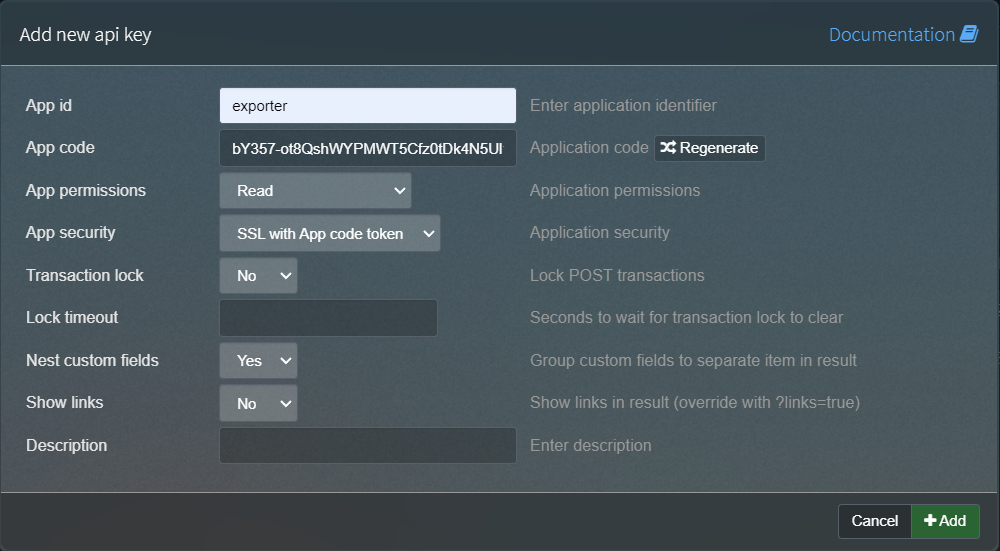

================
PHPIPAM_EXPORTER
================
About
============
This is a fork of BlackSmith `PHP IPAM Exporter <https://github.com/BlackSmith/phpipam_exporter/>`_.

Difference between the two
--------------------------
Instead of using subnets to generate the dhcp config, this fork useses the assigned device to a subnet to find all subnets a device is responsible for.
In this exporter it is also possible to configure dhcp options for a subnet, as well as for one particular client.

Installation
============

``git clone https://github.com/takalele/phpipam_exporter``

``cd phpipam_exporter``

``pip install .``

You can run the exporter directly on the device if it supports python3 or you can use a deployment server with ansible.

Configuration needed in PHP IPAM
============

Enable API plugin:  ``Administration > phpIPAM settings > API = On``

Create token: ``Administration > API > Create API key``

.. list-table:: **Token parameters**
    :header-rows: 0

    * - ``App ID``
      - ``exporter``
    * - ``App permissions``
      - ``Read``
    * - ``App security``
      - ``SSL with App code token``
    * - ``Nest custom fields``
      - ``Yes``

Copy ``App code`` and use it as ``PHPIPAM_TOKEN``.
``App ID`` has to be used as part of ``PHPIPAM_HOST``.

Custom fields
============
Necessary custom fields
------------------------

.. list-table:: **Custom Subnets fields**
    :header-rows: 1

    * - Name
      - Descripton
      - Type
      - Size/Length
      - Default value
      - Required field
      - Possible Values
    * - DHCP
      - DHCP on/off (0=off, 1=on)
      - boolean
      - 1
      - 0
      - yes
      - 1
    * - DHCP_CONF_VAR_LEASE_TIME
      - Lease Time
      - varchar
      - 3
      - 8h
      - yes
      - int[m|h]

.. list-table:: **Custom Devices fields**
    :header-rows: 1

    * - Name
      - Descripton
      - Type
      - Size/Length
      - Default value
      - Required field
    * - DHCP_FORMAT
      - dnsmasq,dhcpd
      - enum
      - 'dnsmasq','dhcpd','None'''	
      - dnsmasq
      - yes

.. list-table:: **Screenshots**
    :header-rows: 0

    * - .. image:: img/dhcp_boolean.png
      - .. image:: img/dhcp_lease_time.png
      - .. image:: img/device_dhcp_format.png

Optional custom fields
-----------------------

.. list-table:: **Custom Subnets fields**
    :header-rows: 1

    * - Name
      - Descripton
      - Type
      - Size/Length
      - Default value
      - Required field
      - Possible Values
    * - DHCP_RANGE_START
      - First DHCP IP
      - text
      - 
      - 
      - no
      - 10.0.0.x
    * - DHCP_RANGE_END
      - Last DHCP IP
      - text
      - 
      - 
      - no
      - 10.0.0.x
    * - DHCP_OPTION_[YOURCHOICE]
      - <depends on the option>
      - text
      - <depends on the option>	
      - 
      - no
      - 3,10.0.0.1 or router,10.0.0.1
    * - DHCP_OPTION_FORCE_[YOURCHOICE]
      - <depends on the option>
      - text
      - <depends on the option>	
      - 
      - no
      - 6,8.8.8.8 or dns-server,8.8.8.8

.. list-table:: **Screenshots**
    :header-rows: 0

    * - .. image:: img/dhcp_range_start.png
      - .. image:: img/dhcp_range_end.png
      - .. image:: img/dhcp_option.png
      - .. image:: img/dhcp_option_force.png

.. list-table:: **Custom IP addresses fields**
    :header-rows: 1

    * - Name
      - Descripton
      - Type
      - Size/Length
      - Default value
      - Required field
      - Possible Values
    * - DHCP_OPTION_[YOURCHOICE]
      - <depends on the option>
      - text
      - <depends on the option>	
      - 
      - no
      - 3,10.0.0.1 or router,10.0.0.1
    * - DHCP_OPTION_FORCE_[YOURCHOICE]
      - <depends on the option>
      - text
      - <depends on the option>	
      - 
      - no
      - 6,8.8.8.8 or dns-server,8.8.8.8

.. list-table:: **Screenshots**
    :header-rows: 0

    * - .. image:: img/ip_add.png

For more information about possible DHCP_OPTION values use ``dnsmasq --help dhcp``

Usage
============

All parameters can also be defined as environment variables.

.. list-table:: **Program parameters**
    :header-rows: 1

    * - Parameter
      - ENV variable
      - Required
      - Description
    * - ``--host``
      - ``PHPIPAM_HOST``
      - Yes
      - phpipam API entrypoint format ``https://<fqdn>/api/<api_id>/`` (e.g. ``https://phpipam.example.com/api/exporter/``)
    * - ``--token``
      - ``PHPIPAM_TOKEN``
      - Yes
      - phpipam API token.
    * - ``--on-change-action``
      - ``PHPIPAM_ON_CHANGE_ACTION``
      - No
      - Bash command. This command is fired only when the output file is changed. This parameter has to be defined only together with ``--output``. (e.g. ``systemctl reload named``)
    * - ``--custom-template``
      - ``PHPIPAM_CUSTOM_TEMPLATE``
      - No
      - Path to custom `Jinja <https://jinja2docs.readthedocs.io/en/stable/>`_ template file.
    * - ``--secure/--insecure``
      - ``PHPIPAM_VERIFY``
      - No (default: ``--secure``)
      - Disable TLS certificate verification.

Output file: dnsmasq configuration file
------------------------------------------

**<devicename>.conf**

.. code-block::

    ############################################################################
    # Generated for subnet dhcp-test Network 192.168.0.0/24
    ############################################################################
    dhcp-range=dhcp-test,192.168.0.2,192.168.0.254,255.255.255.0,8h
    #
    dhcp-option=dhcp-test,3,192.168.0.1
    dhcp-option=dhcp-test,6,192.168.0.1
    #
    dhcp-option-force=tag:test-option-dhcp-test-0011327e173f,3,192.168.0.15
    #
    dhcp-host=00:00:01:02:03:04,dhcp-test,192.168.0.20,test
    dhcp-host=test2,dhcp-test,192.168.0.21
    dhcp-host=00:11:32:7e:17:3f,dhcp-test,192.168.0.23,test-option,set:test-option-dhcp-test-0011327e173f

Deploy with ansible
---------------------
To deploy a newly generated dnsmasq.config file to an OpenWRT router via ansible, you can use the following command as an example

``phpipam_export --host https://<your-php-ipam-host>/api/exporter/ --token <bY357-ot8QshWYPMWT5Cfz0tDk4N5Ul1>--on-change-action 'ansible-playbook dnsmasq.yaml -i hosts_prod'``

Compatibility
---------------------
Only tested with dnsmasq. 

If you need a dhcpd config, you have to adjust the template.
